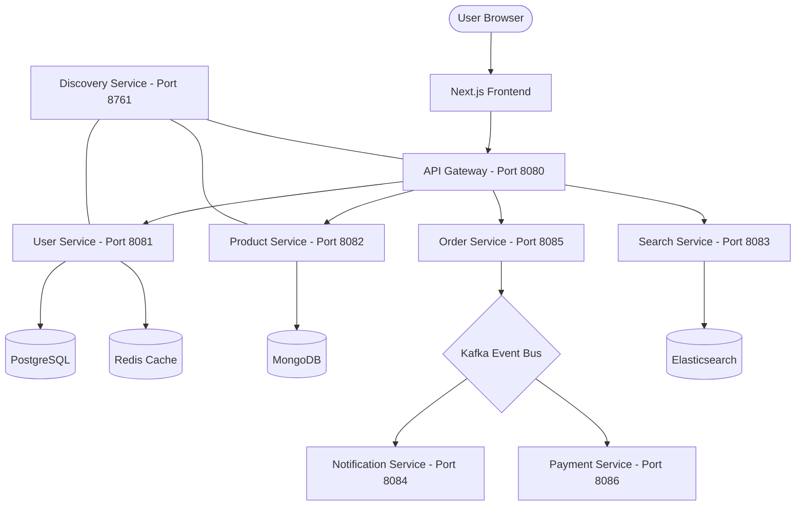

# 🛒 GadgetMart: Premium Tech Hub

**Live Links:**
- **Storefront (Frontend):** [http://52.140.120.94:3000](http://52.140.120.94:3000)
- **API (Backend Gateway):** [http://52.140.120.94:80](http://52.140.120.94:80)

GadgetMart is a modern, microservices-based e-commerce platform designed to aggregate tech deals from multiple sources (Amazon, Flipkart, etc.). It features a revamped, high-performance frontend and a robust backend architecture.

## 🏗️ Architecture Overview

The system is built using a **Spring Cloud Microservices** architecture, coordinated with **Netflix Eureka** for discovery and **Spring Cloud Gateway** for routing.

## 🚀 Key Microservices

| Service | Port | Responsibility | Tech Stack |
| :--- | :--- | :--- | :--- |
| **Discovery Service** | 8761 | Service Registry (Eureka) | Spring Boot |
| **API Gateway** | 8080 | Central Entry Point & Routing | Spring Cloud Gateway |
| **User Service** | 8081 | Auth, JWT, OTP, Saved Products | PostgreSQL, Redis |
| **Product Service** | 8082 | Catalog, Real-time Aggregation | MongoDB, Apify |
| **Search Service** | 8083 | Fast Product Discovery | Elasticsearch |
| **Notification Service**| 8084 | Email Alerts & OTP Delivery | Kafka, Java Mail |
| **Order Service** | 8085 | Checkout & Order Management | PostgreSQL, Kafka |
| **Payment Service** | 8086 | Razorpay Integration | Kafka, Razorpay API |

## 🛠️ Getting Started

### Prerequisites
- **Docker Desktop** (Required for Databases & Brokers)
- **Java 21**
- **Maven**
- **Node.js 18+**

### Quick Start
1. **Start Infrastructure**: `docker-compose up -d`
2. **Setup Databases**: Run the setup script or manual SQL found in `LOCAL_SETUP.md`.
3. **Build Backend**: `mvn clean install -DskipTests`
4. **Start Services**: Run the JARs in the order specified in `LOCAL_SETUP.md`.
5. **Run Frontend**: `cd frontend && npm install && npm run dev`

---

## 💎 Features
- **Smart Comparison**: Live data from multiple platforms.
- **Elite Member Dashboard**: OTP-based login and profile management.
- **Saved Products**: Bookmark your favorite gadgets.
- **Microservice Resiliency**: Isolated services with Kafka-driven events.
- **Modern UI**: Clean, high-performance Inter-font typography and Glassmorphism.

---
*Created with ❤️ for the GadgetMart Community.*
